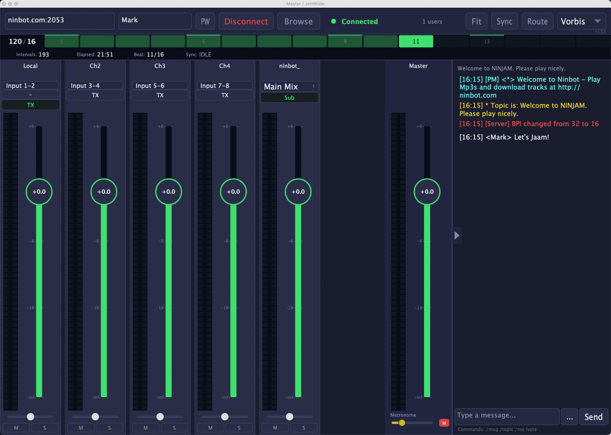

  
  <h1>JamWide</h1>
  
Jam with musicians worldwide — right inside your DAW or standalone

  
  

    <a href="/download" class="btn btn-primary">Download</a>
    <a href="https://github.com/mkschulze/JamWide" class="btn">View on GitHub</a>
  

---

## What is JamWide?

JamWide brings [NINJAM](https://www.cockos.com/ninjam/) — the open-source internet jam session software — directly into your favorite DAW as a plugin, or runs as a standalone app.

Load JamWide, connect to a server, and start jamming with musicians around the globe. Built with [JUCE](https://juce.com/) for native performance on macOS, Windows, and Linux.

---

## Why Use JamWide?

| Traditional Setup | With JamWide |
|-------------------|--------------|
| Separate NINJAM app | Plugin in your DAW or standalone app |
| Stereo mix only | 17 stereo output buses — route each musician to a separate track |
| Vorbis compression only | FLAC lossless audio alongside Vorbis |
| Manual BPM management | DAW transport sync with live BPM/BPI changes |
| Limited processing | Full plugin chain access on every participant |

---

## Key Features

| | |
|---|---|
| **DAW Integration** | VST3, AU, CLAP, and Standalone. Works in Ableton, Logic, REAPER, Bitwig, Cubase, and more. |
| **Multichannel Routing** | Route each remote musician to a separate stereo track in your DAW for independent mixing and processing. |
| **FLAC Lossless Audio** | Send and receive uncompressed audio quality. Switch between FLAC and Vorbis per session. |
| **DAW Transport Sync** | Plugin only broadcasts when the DAW is playing. Live BPM/BPI changes without reconnecting. |
| **Full Mixer** | Per-channel volume, pan, mute, solo with real-time VU meters. State persists across DAW save/load. |
| **OSC Remote Control** | Bidirectional OSC server for TouchOSC and other control surfaces. Full parameter mapping with echo suppression. |
| **Built-in Chat** | Communicate with other musicians in the session. Vote on BPM/BPI changes inline. |

---

## Supported Formats

| Format | Platform | Hosts |
|--------|----------|-------|
| **VST3** | macOS, Windows, Linux | Ableton Live, Bitwig, Cubase, REAPER, Studio One |
| **AU v2** | macOS | Logic Pro, GarageBand, MainStage |
| **CLAP** | macOS, Windows, Linux | Bitwig Studio, REAPER |
| **Standalone** | macOS, Windows, Linux | No DAW required |

---

## How NINJAM Works

Unlike traditional low-latency approaches, NINJAM embraces internet delay creatively:

1. **Everyone hears the previous interval** — You play along with what others recorded in the last cycle
2. **Time-synchronized jamming** — The server keeps everyone in sync with a shared BPM/BPI
3. **Creative collaboration** — The delayed approach creates unique musical possibilities

This means you can jam with someone across the world with the same experience as someone across town.

---

## Get Started

  <a href="/download" class="btn btn-primary btn-large">Download JamWide</a>
  
Available for macOS, Windows, and Linux

---

## Open Source

JamWide is open source under the GPL-2.0 license. Contributions welcome!

  
  
  

---

*Made with music for musicians who want to jam together, anywhere in the world.*
